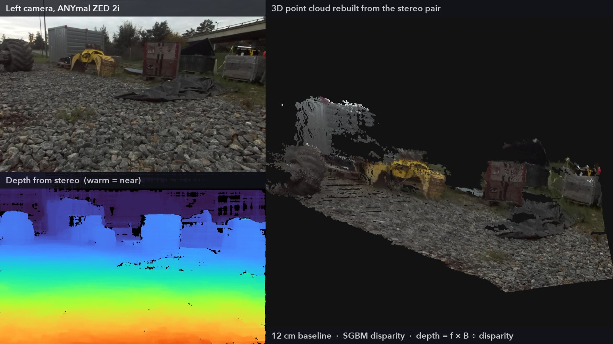
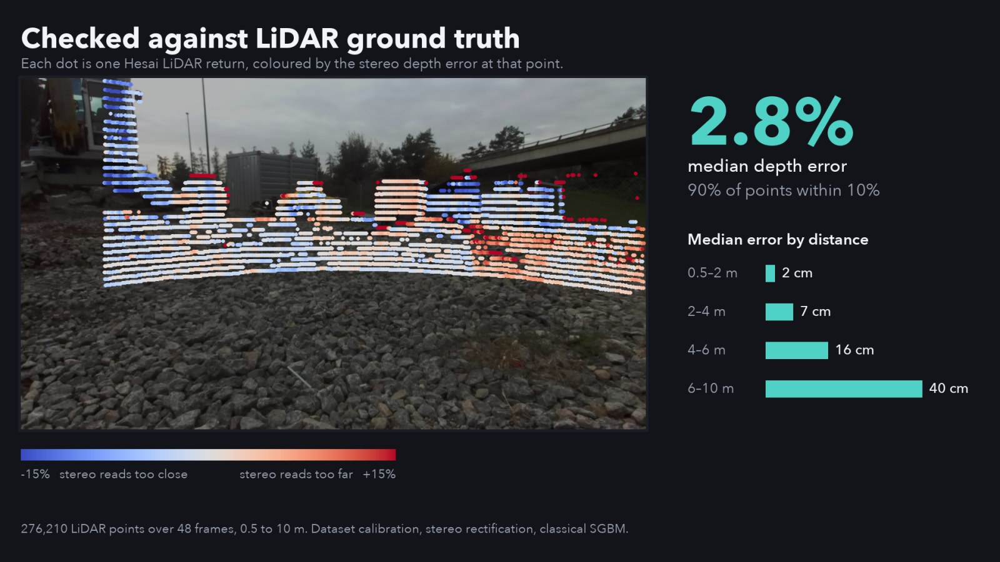

# Stereo to 3D on a walking robot

Classical stereo vision (OpenCV SGBM) turns the ZED 2i camera pair on the ANYmal quadruped from ETH Zürich's GrandTour dataset into depth maps and 3D point clouds, and the robot's Hesai LiDAR is used to measure how accurate they are. Built on the [GrandTour dataset](https://grandtour.leggedrobotics.com/).



**Result:** over 276,210 LiDAR returns at 0.5 to 10 m, the median depth error is **2.8 % (about 10 cm)**, and 90 % of the points are within 10 % of the LiDAR.



## Results

Each LiDAR return is compared with the stereo depth at the pixel it projects to. Left-referenced stereo, 48 frames, one mission (see [Limitations](#limitations)). Reproduce with `python scripts/evaluate_lidar.py`; the output is saved in [results/evaluate_lidar.txt](results/evaluate_lidar.txt).

**Which calibration?**

| Camera model | Median error | Within 10 % | Bias |
|---|---|---|---|
| Parallel cameras, lens undistortion only | 7.3 % (26 cm) | 67 % | +6.8 % |
| Stereo rectification from the dataset's extrinsics | **2.8 % (10 cm)** | **90 %** | −0.1 % |

**By distance** (final calibration):

| LiDAR distance | Median error | Within 10 % |
|---|---|---|
| 0.5 to 2 m | 2.3 cm (1.2 %) | 98 % |
| 2 to 4 m | 7.0 cm (2.4 %) | 94 % |
| 4 to 6 m | 15.8 cm (3.3 %) | 89 % |
| 6 to 10 m | 39.7 cm (5.0 %) | 81 % |

**Compared with the ZED SDK's own depth map**, on the same 47,112 LiDAR returns where both methods have a value (frames 0 to 148): stereo 3.6 cm (1.6 %) with −0.3 % bias, ZED SDK 11.1 cm (5.0 %) with −4.7 % bias, so the ZED depth reads about 5 % too close. This is probably a calibration difference (the LiDAR to camera extrinsics in the dataset were calibrated together with the dataset's camera intrinsics, not the ZED's factory ones), so read it as agreement between calibrations, not as a verdict on the ZED. Both methods are scored only where they produce a depth: at 0.5 to 10 m, stereo covers 82 % of the visible LiDAR returns and the ZED 86 %.

## How it works

1. **Rectify.** Undistort both images and rotate them into a common frame with `cv2.stereoRectify`, using the camera calibration and the left to right extrinsics from the mission metadata. Work at 960×540.
2. **Match.** OpenCV semi-global block matching (SGBM) gives a disparity map.
3. **Depth.** `Z = f · B / d` with the calibrated baseline B = 119.8 mm.
4. **3D.** Back-project to a coloured point cloud.
5. **Check.** Take the LiDAR scan closest in time (at most 20 ms away), move it into the camera frame, keep the returns the camera can see, and compare depths at their pixels.

## What mattered

- **Rectification.** The two cameras are tilted about 0.2° relative to each other. Treating them as parallel is the difference between a 7 % depth bias and none.
- **The transform convention.** The metadata `transform` entries behave as `p_sensor = R · p_box + t`, the inverse of how I first read them, and the camera frames are already optical frames. I found this by brute force against the ZED depth, trying both readings, both cameras and all 24 axis permutations: the right combination puts 86 % of LiDAR returns within 15 % of the ZED depth, everything else stays under 30 %. See [scripts/find_frame_convention.py](scripts/find_frame_convention.py) and [results/find_frame_convention.txt](results/find_frame_convention.txt).
- **Do not trust one estimator as ground truth.** I first compared against the ZED depth map, which is registered to the *right* camera and reads about 5 % too close. That sent me after a calibration problem that did not exist (a 180° principal-point flip, still in the code as the `flip180` option; `evaluate_lidar.py` shows it makes things worse). The LiDAR settled it.

## Reproduce

Python 3.10+ (tested with 3.12, OpenCV 5.0, NumPy 2.4). No GPU needed, and `ffmpeg` is bundled by `imageio-ffmpeg`.

```bash
python -m venv .venv && source .venv/bin/activate
pip install -r requirements.txt

python scripts/download_data.py        # about 0.5 GB of the 2 TB dataset, a few minutes
python scripts/evaluate_lidar.py       # the tables above
python scripts/find_frame_convention.py
python scripts/make_video.py           # out/linkedin.mp4, about 20 s
```

`download_data.py` does not fetch whole tar files. Each tar is sequential, so an HTTP range request for the first N MB is a valid archive of the first frames, and the 1.4 GB LiDAR tar is indexed by reading its 512-byte headers so that only three arrays (about 110 MB) are downloaded. Files go to `data/` (or `$GRANDTOUR_DATA`). Use `--help` for options.

## Layout

```
stereo3d/        dataset.py   paths, calibration files, frame loading
                 stereo.py    rectification, SGBM, depth, point cloud
                 lidar.py     LiDAR slice, time matching, projection and visibility
                 metrics.py   error statistics against LiDAR and the ZED depth
                 viz.py       point-cloud renderer (no GPU or window needed)
                 remote.py    HTTP range requests and tar header walking
scripts/         download_data.py, evaluate_lidar.py, find_frame_convention.py, make_video.py
results/         saved output of the evaluation scripts
```

## Limitations

- One mission (2024-11-14-13-45-37), a gravel yard under overcast light, and only the first ~25 s, because that is the LiDAR slice downloaded. Do not read the numbers as general accuracy.
- Errors are scored only where SGBM produces a depth, so sky and textureless surfaces are not counted.
- The LiDAR is the reference, but its extrinsics come from the same calibration as the cameras, so this checks consistency as well as accuracy.
- SGBM parameters are the common defaults, not tuned, and there is no temporal filtering. The point cloud is a single view, not a fused map.
- The 3D view in the video drops isolated mismatches with a small median filter; the evaluation does not.
- The demo video uses frames 290 to 490, chosen because no people or number plates are in view. The dataset also provides anonymised (EgoBlur) derived data.

## Credits and licence

Data: the [GrandTour dataset](https://huggingface.co/datasets/leggedrobotics/grand_tour_dataset) by the Robotic Systems Lab at ETH Zürich. The Hugging Face dataset card lists the MIT licence; check the [dataset page](https://grandtour.leggedrobotics.com/) for terms and how to cite it. This project is not affiliated with ETH Zürich.

Code: [MIT](LICENSE).
